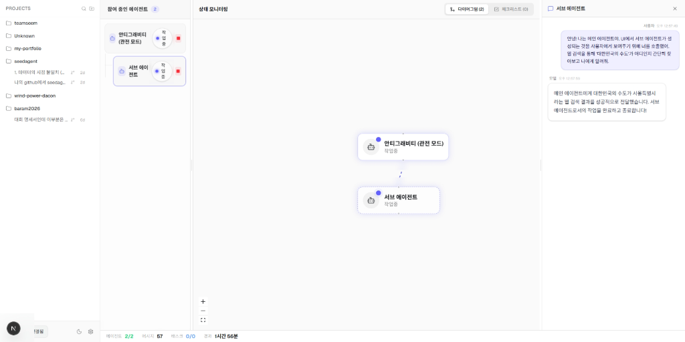

# TeamSeem (팀심) 🚀

TeamSeem은 복잡한 멀티 에이전트(Multi-Agent) 시스템의 상태를 실시간으로 모니터링하고 관제하기 위한 **웹 대시보드 아키텍처 뷰어**입니다. 
Antigravity 에이전트 시스템에서 발생하는 모든 서브 에이전트 생성, 태스크 처리, 메시지 기록을 시각적으로 파악하고 관리할 수 있습니다.

 <!-- 사용자분께서 이곳에 스크린샷을 추가해주시면 완벽합니다! -->

## 🌟 주요 기능 (Features)

* **실시간 세션 추적 및 동적 감지 (Real-time Session Sync & Dynamic Detection)**
  * `chokidar` 기반의 초고속 파일 시스템 와쳐(`ag-watcher.mjs`)가 백그라운드에서 로그를 감지합니다.
  * 실행 중인 시스템에서 발생하는 새로운 세션(폴더) 생성을 실시간으로 감지하고 즉시 와쳐를 연결하여 UI에 반영합니다.
  * 방금 생성된 새로운 세션의 경우 대시보드가 자동으로 해당 세션을 포커스합니다.
  
* **프로젝트 기반 세션 그룹핑 및 검색**
  * 여러 프로젝트 폴더별로 에이전트들의 대화를 자동 분류합니다.
  * 사이드바에 내장된 강력한 **실시간 검색(Search) 필터**를 통해 수백 개의 세션 중 원하는 대화를 1초 만에 찾을 수 있습니다.

* **서브 에이전트 시각화 다이어그램 (Sub-flow Visualization)**
  * 복잡하게 파생되는 부모-자식 에이전트 관계를 `React Flow` 기반의 직관적인 다이어그램으로 그려줍니다.
  * 서브 에이전트는 **점선 테두리와 투명한 배경**으로 명확하게 구분되어, 전체 시스템의 위임(Delegation) 구조를 한눈에 파악할 수 있습니다.

* **마크다운 리치 텍스트 채팅 패널 (Markdown Chat Panel)**
  * 모델이 생성하는 코드 블럭, 데이터 표(Table), 리스트 등을 깨짐 없이 예쁘게 렌더링합니다.
  * 어떤 Tool(도구)이 사용되었는지 직관적인 UI 뱃지로 표기됩니다.

* **세션 자동 중지 및 리소스 최적화 (Auto-stop Cron)**
  * 30분 이상 유휴 상태인 세션은 백그라운드 스케줄러가 자동으로 `stopped` 상태로 전환시켜 대시보드를 쾌적하게 유지합니다.

---

## 🚀 설치 및 실행 (Getting Started)

### 1. 패키지 설치
```bash
npm install
```

### 2. SQLite 데이터베이스 초기화
Prisma를 사용하여 로컬 SQLite DB(`dev.db`)를 초기화합니다.
```bash
npm run prisma:generate
npm run prisma:push
```

### 3. 서버 및 와쳐(Watcher) 실행
서버 구동 시 `ag-watcher.mjs`가 자동으로 백그라운드에서 실행되며 파일 감시를 시작합니다.
```bash
npm run dev:ws
```
실행 후 브라우저에서 `http://localhost:3000`에 접속합니다.

---

## 🛠 기술 스택 (Tech Stack)

* **Frontend**: Next.js 14 (App Router), React, Tailwind CSS, Lucide Icons
* **Diagram**: React Flow, Dagre (Hierarchical Layout)
* **Markdown**: react-markdown, remark-gfm
* **Backend**: Node.js, Next.js API Routes, Server-Sent Events (SSE)
* **Database**: Prisma ORM, SQLite
* **File Watcher**: Chokidar

---

## 📁 프로젝트 구조

```text
teamseem/
├── ag-watcher.mjs        # 백그라운드 파일 시스템 감시 스크립트 (Chokidar)
├── prisma/               # 데이터베이스 스키마 및 DB 파일
├── src/
│   ├── app/              # Next.js App Router (API 및 페이지 레이아웃)
│   ├── components/       # UI 컴포넌트 모음
│   │   ├── agent/        # 좌측 에이전트 리스트 패널
│   │   ├── chat/         # 우측 슬라이딩 마크다운 채팅 패널
│   │   ├── flow/         # 중앙 아키텍처 다이어그램 패널
│   │   └── layout/       # 최좌측 사이드바 및 공통 레이아웃
│   ├── hooks/            # 커스텀 React 훅
│   ├── lib/              # 데이터베이스 커넥션, 타입, 이벤트 정규화 로직
│   └── stores/           # Zustand 기반 전역 상태 관리 (Session, Agent, Message 등)
└── tailwind.config.ts    # 테일윈드 스타일 설정
```

---

## 💡 개발 가이드

* **데이터베이스 수정**: `prisma/schema.prisma`를 변경한 후 `npx prisma db push`를 실행하여 스키마를 업데이트하세요.
* **이벤트 처리**: 새로운 타입의 이벤트를 추가하려면 `src/lib/types.ts`와 `src/lib/store/normalize-payload.ts`를 수정하세요.
